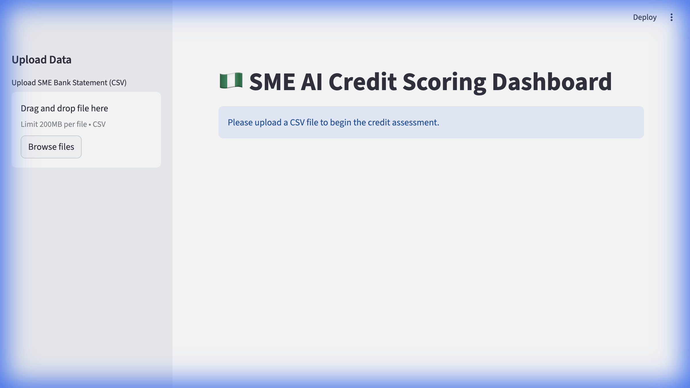

# 🇳🇬 SME AI Credit Scoring System

An AI-powered credit scoring dashboard built for Nigerian SME lenders. Upload a bank statement CSV and get an instant credit risk assessment — powered by LLM-based transaction analysis, a multi-signal scoring engine, and an AI-generated underwriter's memo.



## Features

- **Smart Bank Statement Processing** — Auto-detects column formats from different Nigerian bank CSV exports, parses multiple date formats, and validates minimum 3-month statement period
- **Statement Overview** — Instant visual summary of the uploaded statement: transaction count, months covered, and period dates
- **Monthly Trends Chart** — Income vs. expenses bar chart with net cash flow trend line
- **AI Transaction Categorization** — Uses Google Gemini (via OpenRouter) to classify each transaction as *Business Income*, *Operational Expense*, *Personal*, or *High Risk*
- **Multi-Signal Credit Scoring** — Generates a 0–100 risk score based on 10 weighted factors:
  - Expense ratio & income volatility
  - Income frequency & revenue diversification
  - Co-mingling detection (personal spending on business accounts)
  - High-risk behavioral flags (e.g. betting platforms)
  - Monthly income trend (growing vs declining)
  - Expense stability & activity gaps
  - Data sufficiency
- **AI Credit Memo** — A Senior Credit Analyst–style narrative tailored to the Nigerian SME lending context
- **PDF Report Generation** — Downloadable credit analysis report with executive summary and underwriter notes

## Tech Stack

| Component | Technology |
|---|---|
| Frontend | Streamlit |
| AI/LLM | Google Gemini 2.0 Flash (via OpenRouter) |
| Data Processing | Pandas |
| Visualization | Plotly |
| PDF Generation | fpdf2 |

## Getting Started

### Prerequisites

- Python 3.10+
- An [OpenRouter](https://openrouter.ai/) API key

### Installation

```bash
# Clone the repo
git clone https://github.com/Elvaceishim/sme-css.git
cd sme-css

# Create and activate a virtual environment
python3 -m venv venv
source venv/bin/activate

# Install dependencies
pip install -r requirements.txt
```

### Configuration

Create a `.env` file in the project root (see `.env.example`):

```
OPENROUTER_API_KEY=your_openrouter_api_key_here
```

### Run

```bash
streamlit run app.py
```

Then open [http://localhost:8501](http://localhost:8501) in your browser.

### Sample Input

Upload a CSV bank statement. The system auto-detects common Nigerian bank formats:

**Standard format:**

| date | description | amount | type |
|---|---|---|---|
| 2025-10-02 | Transfer from ADAMU BELLO | 85000 | Credit |
| 2025-10-03 | POS PURCHASE - BOLA FABRICS | -15000 | Debit |

**Split credit/debit format:**

| date | narration | credit | debit |
|---|---|---|---|
| 2025-10-02 | Transfer from ADAMU BELLO | 85000 | |
| 2025-10-03 | POS PURCHASE - BOLA FABRICS | | 15000 |

> **Note:** A minimum of **3 months** of transaction history is recommended for accurate scoring.

## Project Structure

```
sme-css/
├── app.py                    # Streamlit dashboard (entry point)
├── statement_validator.py    # Bank statement format detection & validation
├── transaction_processor.py  # LLM-powered transaction categorizer
├── scorer.py                 # Multi-signal credit scoring engine (10 factors)
├── memo_generator.py         # AI credit memo generator
├── report_gen.py             # PDF report builder
├── transactions.csv          # Sample 4-month bank statement
├── requirements.txt
├── .env.example
└── docs/
    └── dashboard_preview.png
```

## License

This project is for educational and demonstration purposes.
